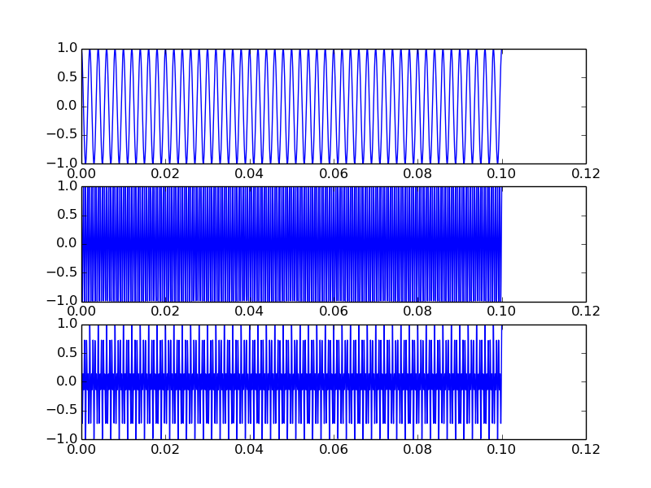
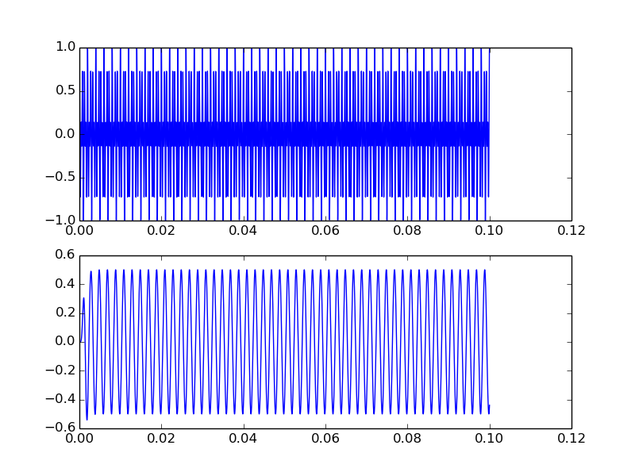
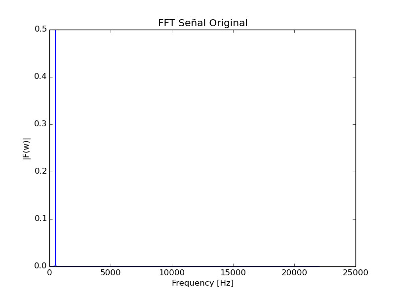
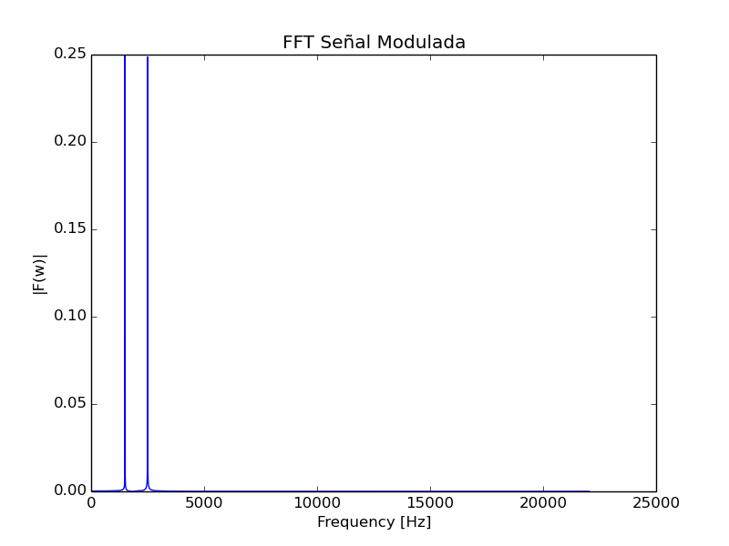
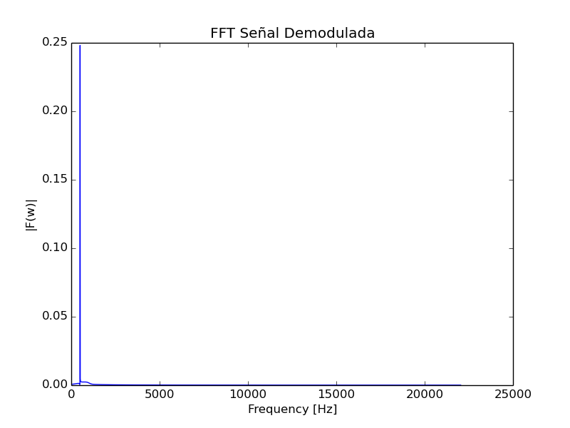

Documentación Etapa 2
===============

En este documento se presenta una guía que permite explicar el funcionamiento del software para la asignatura Redes de Computadores, en el que se busca transmitir datos entre dos computadores que tengan micrófono y parlante.

Descripción del Proceso
------------------

Para la segunda etapa del proyecto se desarrollan 2 partes.
* Parte 1: Lectura de una imagen (blanco y negro) en bits y transformación a señal con bitRate configurable.
* Parte 2: Modulación y Demodulación AM de señal y análisis de ésta.

Módulos Generales y su Función
------------------

En esta sección se describe los módulos que componen el programa y sus funciones.

> - IO: En este módulo se encuentran todas las funciones de entrada y salida, esto incluye Imagenes y Audio. 
> - Plot: En este módulo en encuentran funciones que realizan los gráficos, esto incluye gráfico de señal, Transformada de Fourier, Spectrograma.
> - Filter: Este módulo cuenta con las funciones que pretenden eliminar el ruido de las señales aplicando diferentes técnicas.
> - Tools: Módulo que contiene herramientas auxiliares utilizadas.

Resultados
--------------------
Al ejecutar el código de prueba para la etapa 2, es decir, el archivo "main2.py", se desarrolla la parte 1 especificada
anteriormente, primero se lee la imagen en blanco y negro y se obtienen los frames en enteros de 16 bits (para evitar overflow)
luego se pasan éstos frames a su representación en binario para obtener los bits, los que luego son procesados y transformados
a señal a un bitRate determinado (éste es configurable), adicionalmente se modula la señal por amplitud (AM) a una frecuecia audible y se 
crea un archivo .wav con la señal modulada.

Para la parte 2, se realiza una modulación AM para un señal, utilizando un coseno como señal portadora, de esto se obtienen
los siguientes resultados:

Luego de esto, se realiza la demodulación, por lo cual se hace la comparación entre la señal modulada y la demodulada:

#### Análisis:

- **Modulación: Espectro señal original**

De la señal original, se grafica la transformada de fourier para visualizar en que frecuencia se ubica ésta:
  

Se puede observar que la señal se encuentra en un frecuencia baja(banda base).

- **Modulación: Espectro señal modulada**

Con la señal ya modulada, se puede observar que ésta se encuentra ahora en un frecuencia mayor:

Un detalle importante, es que la parte que anteriormente era negativa y no tenía significado físico,
ahora pasa a ser parte de la parte positiva del espectro.

- **Modulación: Espectro señal demodulada**

Al demodular la señal, ésta es nuevamente modulada con la señal portadora utilizada y luego le es aplicada un filtro
para recuperar el mensaje original, lo cuál en el espectro de frecuencias da el siguiente resultado:

Se puede observar que la señal recuperada de la demodulación es el mismo mensaje al que se le realizó la modulación en un inicio.

#### Conclusiones Etapa 2:

De la parte 1, se puedo observar que es posible pasar de una imagen a una señal digital que puede ser de audio, esto es debido a que una imagen
es una señal en si, en dos dimensiones, en este caso, al ser en escala de grises solo se tiene una matriz con las dos señales. Otro punto que se
pudo apreciar es que al leer la imagen se obtuvieron una serie de bits que representan los frames de tal imagen, donde para poder
pasar esta cadena de bits a señal, se define un bitRate que es la tasa de datos o velodidad a la que se cambia de estado la señal, es
decir, su período, lo cuál al pasar a un archivo de audio éste parámetro define el tiempo total de la pista de sonido.

En la parte 2, se observó como se comportan las señales cuando se les realiza una modulación por amplitud, es decir, se multiplica
el mensaje por una señal de mayor frecuencia, con tal de desplazar el mensaje en frecuencia para poder adaptar esta señal al medio.
A través de los gráficos se observa claramente como se comporta la señal en el tiempo, antes y despues de ser modulada, aún así solo 
con este gráfico no se puede observar bien cuál fué el cambio realizado, al analizar el espectro de frecuencia de la señal se ve claramente
el desplazamiento en frecuencia del mensaje(incluyendo el espectro negativo). Para la demodulación se observa el proceso inverso, donde 
se modula la señal ya modulada y se le realiza un filtro para poder obtener solo el espectro de la señal original, un detalle importante a destacar,
es que la señal obtenida a pesar de ser igual al mensaje original, ésta tiene menor amplitud debido a la pérdida de energía por los procesos de modulación.