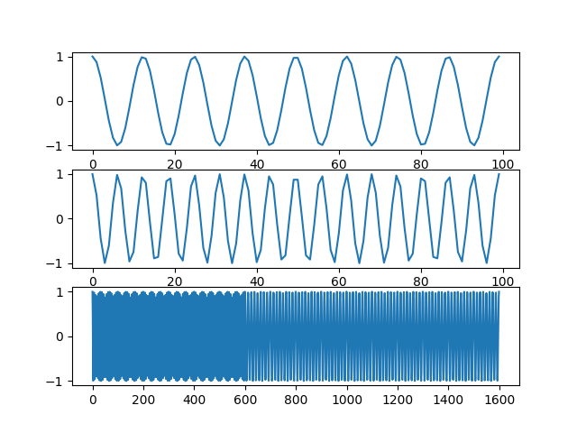
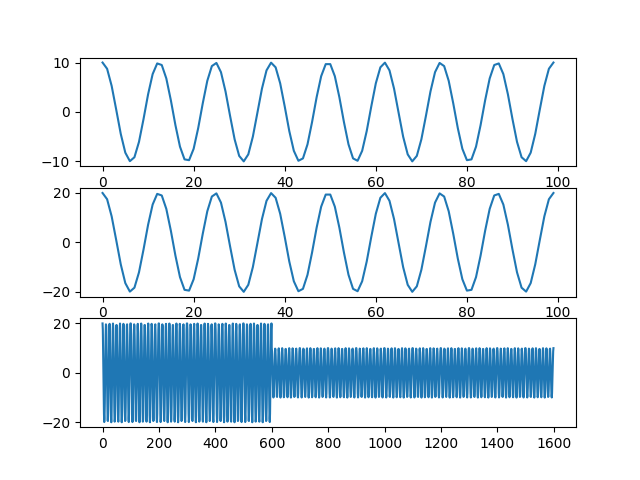
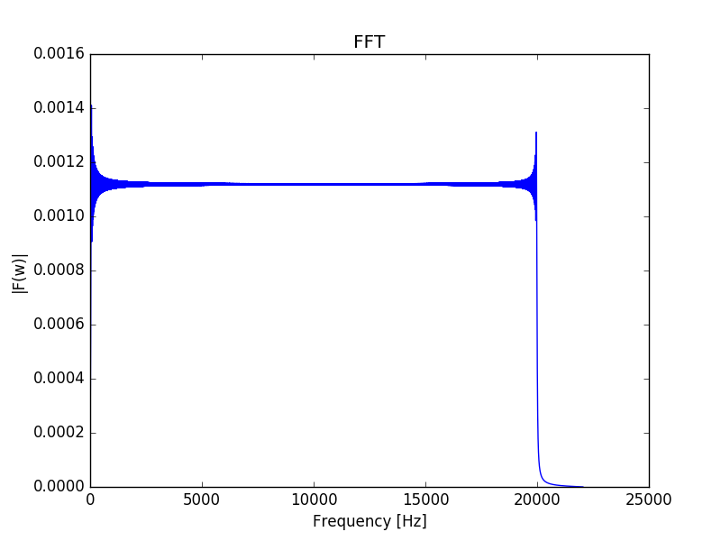
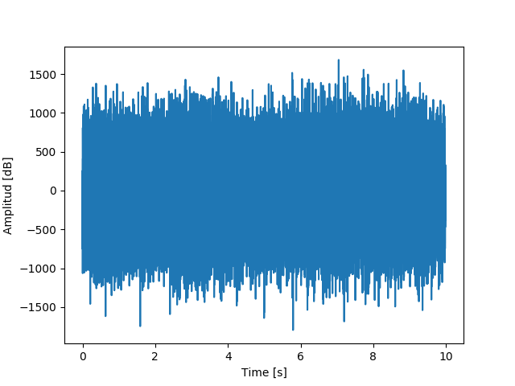
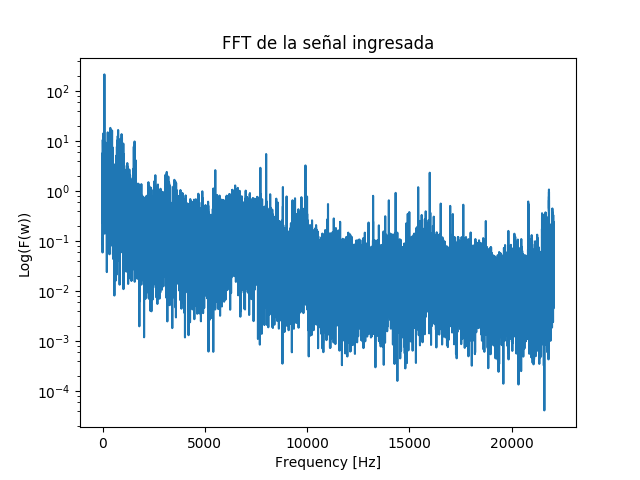
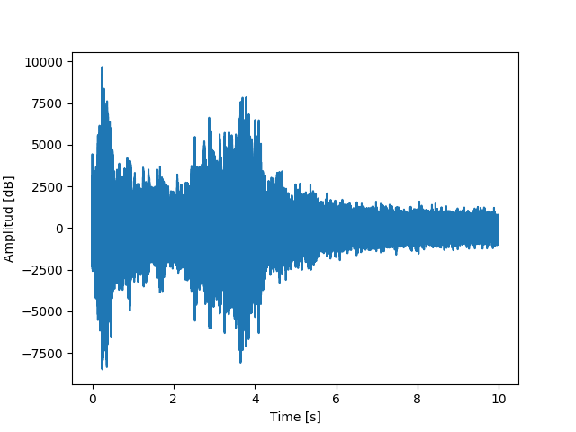
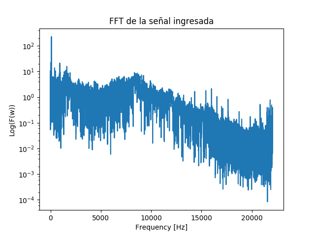
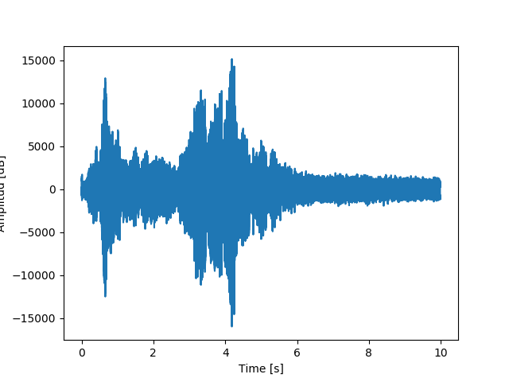
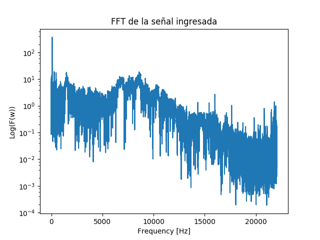

Documentación Etapa 3
===============

En este documento se presenta una guía que permite explicar el funcionamiento del software para la asignatura Redes de Computadores, en el que se busca transmitir datos entre dos computadores que tengan micrófono y parlante.

Descripción del Proceso
------------------

Para la tercera etapa del proyecto se desarrollan 2 partes.
* Parte 1: Modulacion FSK y ASK configurables ambos.
* Parte 2: Estudio de microfono y parlante.

Módulos Generales y su Función
------------------

En esta sección se describe los módulos que componen el programa y sus funciones.

> - IO: En este módulo se encuentran todas las funciones de entrada y salida, esto incluye Imagenes y Audio. 
> - Plot: En este módulo en encuentran funciones que realizan los gráficos, esto incluye gráfico de señal, Transformada de Fourier, Spectrograma.
> - Filter: Este módulo cuenta con las funciones que pretenden eliminar el ruido de las señales aplicando diferentes técnicas.
> - Tools: Módulo que contiene herramientas auxiliares utilizadas.
> - Modulation: En este módulo estan las modulaciones analoga y digital (FSK y ASK).

Resultados
--------------------
Al ejecutar el código de prueba para la etapa 3, es decir, el archivo "main3.py", se desarrolla la parte 1 especificada.
Primero se usa una imagen de prueba para generar una señal digital para realizar la modulacion FSK Y ASK. Luego de hecha la modulación se obtienen los siguientes resultados:

- **Modulación FSK**

- **Modulación ASK**

Para la parte 2 se generó un coseno de frecuencia creciente para analizar todo el rango audible de frecuencias, desde los 20 Hz a los 21 KHz y así estudiar el canal por el que se transmitirán los datos. Se realizaron pruebas con dos dispotivos que se utilizarán para este laboratorio, por una parte el que emite la señal y por otra el que la recibe. Obteniendo los siguientes resultado:

#### **FFT Coseno Creciente**

#### **Prueba del Sonido Ambiente**

- **Prueba dominio del Tiempo**
    

- **Prueba dominio de las Frecuencias**

#### **Prueba 1 trasmisión Señal Coseno Creciente**

- **Prueba dominio del Tiempo**

- **Prueba dominio de las Frecuencias**

#### **Prueba 2 trasmisión Señal Coseno Creciente**

- **Prueba dominio del Tiempo**

- **Prueba dominio de las Frecuencias**
 

#### Conclusiones Etapa 3:
En la parte 1 se divide principalmente en dos subpartes, la primera, donde se realiza una modulación digital ASK, donde
se llevó a través de una portadora a una frecuencia mayor, se puso énfasis en las amplitudes, para que la señal no fuese tan
afectada por el ruido y no sea tan difícil recuperar los datos en el receptor. Para la segunda subparte se hizo una modulación FSK
donde se utilizan dos frecuencias diferentes para realizar la modulación y representar los bits, esta señal dado a que el mensaje va
en la frecuencia de la señal, es más resistente al ruido que ASK, más especificamente al ruido blanco gaussiano aditivo. Para realizar la demodulación
se implementó un banco correlacionador, de esta forma no es relevante la modulación usada en la señal que se recive, ésta igualmente puede
ser demodulada y decodificar el mensaje que porta. Para la siguiente etapa se hará uso de estas herramientas desarrolladas para el traspaso real de datos
desde una maquina a otra mediante ondas de audio, cabe destacar que cabe la posibilidad de implementar una nueva modulación mejor para mejorar la trasmisión.

En la parte 2 se observó que dado el micrófono del dispositivo receptor y el parlante del emisor, el rango de frecuencias en que mayormente la señal es trasmitida de manera notoria es entre los 6 KHz y  los 10 KHz., ya que como se puede observar en los resultados es en donde la Transformada de Fourier al realizar la prueba 1 y la prueba 2, sufre más cambios en el dominio de la frecuencia en comparación a la Tranformada del sonido ambiente.

